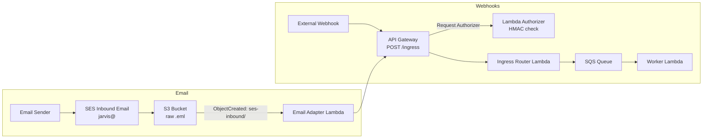

# Jarvis Ingress (AWS CDK v2)

## Architecture Overview
This stack provides a signed ingress API backed by SQS and an email ingestion path via SES + S3.

**Webhook flow**
1. External webhooks call **API Gateway REST API** `POST /ingress`.
2. A **Lambda Request Authorizer** validates HMAC headers `x-jarvis-timestamp` and `x-jarvis-signature`.
3. The **ingress/router Lambda** enqueues work to **SQS**.
4. A **Worker Lambda** consumes SQS and performs actions.

**Email flow**
1. **SES inbound email** for `jarvis@<domain>` stores raw mail in **S3**.
2. **S3 ObjectCreated notifications** trigger the **Email Adapter Lambda** (not SES LambdaAction).
3. The Email Adapter reads the `.eml` from S3, normalizes it, and calls `POST /ingress` with the same HMAC headers.



## Setup

### Prerequisites
- Python 3.11
- Node.js (for AWS CDK v2)
- AWS credentials configured for **us-east-1**

### Bootstrap + Deploy
```bash
python3 -m venv .venv
source .venv/bin/activate
pip install -r requirements.txt

# One-time bootstrap per account/region
npx -y aws-cdk@2.x bootstrap aws://$ACCOUNT_ID/us-east-1

# Deploy (set context values as needed)
cdk deploy \
  -c inboundEmailDomain=example.com \
  -c jarvisLocalPart=jarvis \
  -c jarvisDomain=example.com \
  -c sesReceiptRuleSetName=jarvis-inbound-rules \
  -c sharedSecretName=jarvis/webhook/shared_secret
```

### Configuration (CDK context keys)
The stack reads the following **context keys** (exact names):
- `inboundEmailDomain` (default: `jarvisassistants.ai`)
- `jarvisLocalPart` (default: `jarvis`)
- `jarvisDomain` (default: `inboundEmailDomain`)
- `sesReceiptRuleSetName` (default: `jarvis-inbound-rules`)
- `sharedSecretName` (default: `jarvis/webhook/shared_secret`)

### GitHub Actions Secrets (OIDC)
The deploy workflow requires:
- `AWS_ROLE_ARN`
- `AWS_REGION`

The role must trust the GitHub OIDC provider and allow the repo/workflow to assume it (ensure the trust policy matches your GitHub org/repo and branch or environment).

## SES + Route 53 (Operational Steps)
1. **Register domain** (or choose an existing domain) and create a **Route 53 hosted zone**.
2. **Delegate nameservers** from the registrar to the Route 53 hosted zone.
3. **Create SES identity** for the domain and enable **DKIM** (Route 53 adds the CNAMEs).
4. **Create/verify MX record** in Route 53 to point inbound mail to SES for `us-east-1`.
5. **Confirm SES verification and DKIM status** are both verified before sending inbound mail.

## Testing

### Find the API endpoint
From CDK:
```bash
cdk output JarvisIngressStack.IngressUrl
```
From CloudFormation:
```bash
aws cloudformation describe-stacks \
  --stack-name JarvisIngressStack \
  --query "Stacks[0].Outputs[?OutputKey=='IngressUrl'].OutputValue" \
  --output text
```

### Test via AWS Console or Postman
- **Headers**:
  - `x-jarvis-timestamp`: unix epoch seconds
  - `x-jarvis-signature`: HMAC SHA-256 hex of `timestamp + "." + methodArn`
- **Body**: JSON payload, e.g. `{ "source": "postman", "message": "hello" }`

In the API Gateway console, open `JarvisIngressApi` → `/ingress` → `POST` and use **Test** with the headers above.

### Test with curl (HMAC signature)
The authorizer signs **exactly**: `timestamp + "." + methodArn`.
`methodArn` format:
`arn:aws:execute-api:{region}:{account}:{api_id}/{stage}/POST/ingress`

```bash
INGRESS_URL=$(cdk output JarvisIngressStack.IngressUrl)
ACCOUNT_ID=$(aws sts get-caller-identity --query Account --output text)
REGION=us-east-1
TIMESTAMP=$(date +%s)
SECRET_VALUE="your-shared-secret"

METHOD_ARN=$(python3 - <<'PY'
from urllib.parse import urlparse
import os
u = urlparse(os.environ["INGRESS_URL"])
api_id = (u.hostname or "").split(".")[0]
stage = u.path.strip("/").split("/")[0]
print(f"arn:aws:execute-api:{os.environ['REGION']}:{os.environ['ACCOUNT_ID']}:{api_id}/{stage}/POST/ingress")
PY
)

SIGNATURE=$(python3 - <<'PY'
import hmac, hashlib, os
payload = f"{os.environ['TIMESTAMP']}.{os.environ['METHOD_ARN']}".encode()
print(hmac.new(os.environ['SECRET_VALUE'].encode(), payload, hashlib.sha256).hexdigest())
PY
)

curl -X POST "$INGRESS_URL" \
  -H "x-jarvis-timestamp: $TIMESTAMP" \
  -H "x-jarvis-signature: $SIGNATURE" \
  -H "Content-Type: application/json" \
  -d '{"source":"curl","hello":"world"}'
```

### Test S3 → Email Adapter Lambda
1. Find the inbound bucket:
   ```bash
   cdk output JarvisIngressStack.InboundEmailBucketName
   ```
2. Upload a raw email to the inbound prefix:
   ```bash
   aws s3 cp ./sample.eml s3://$BUCKET/ses-inbound/sample.eml
   ```
3. Confirm CloudWatch logs for `EmailAdapterFunction` show `email_adapter_publish_ok`.

### End-to-end email test
1. Send an email to `jarvis@<inboundEmailDomain>`.
2. Confirm the `.eml` lands in `s3://<InboundEmailBucketName>/ses-inbound/`.
3. Confirm `EmailAdapterFunction` logs show the POST to `/ingress` succeeded.
4. Confirm an SQS message arrives in `IngressQueue` (or worker logs show `sqs_records_received`).
5. Confirm `WorkerFunction` logs show the record payload.

## Troubleshooting
- **OIDC assume-role failures**: ensure the IAM role trust policy includes your GitHub org/repo and branch/environment in the `sub` condition, and that `AWS_ROLE_ARN` + `AWS_REGION` secrets are set in GitHub Actions.
- **Reserved `AWS_REGION` Lambda env var**: Lambda reserves `AWS_REGION` (provided automatically). Avoid setting it manually in function environment variables.
- **S3 bucket notification overlap**: S3 cannot have overlapping prefixes/suffixes across notifications. Keep distinct prefixes (this stack uses `ses-inbound/` and `ingress-queue/`).
- **Authorizer failures**:
  - Timestamp skew logs are warnings only, but large drift may indicate a clock issue.
  - Signature mismatch: confirm the string to sign is `timestamp.methodArn`, the method ARN matches the deployed API ID/stage/resource, and the secret matches `sharedSecretName` in Secrets Manager.
